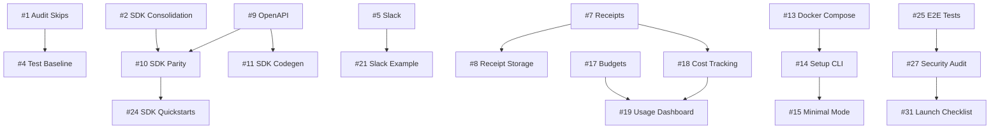

# Aragora Q1-Q2 2026 Backlog

**Version:** 2.1.15
**Created:** January 2026
**Duration:** 16 weeks (Sprints 1-8)
**Focus:** SME Starter Pack, Developer Platform, Self-Hosted Deployment

---

## Executive Summary

This backlog delivers three parallel tracks optimized for **time-to-first-value** for SMEs and developers:

| Track | Goal | Key Deliverable |
|-------|------|-----------------|
| **SME Starter Pack** | 10-minute onboarding | Working Slack/Teams integration with budget controls |
| **Developer Platform** | SDK parity + docs | OpenAPI 3.1, TypeScript SDK, example apps |
| **Self-Hosted** | One-command deploy | `docker compose up` with guided setup |

---

## Sprint Overview

| Sprint | Weeks | Theme | Track Focus |
|--------|-------|-------|-------------|
| 1 | 1-2 | Foundations | Audit, cleanup, version sync |
| 2 | 3-4 | SME Core | Slack/Teams + Decision Receipts |
| 3 | 5-6 | Developer DX | OpenAPI + SDK parity |
| 4 | 7-8 | Self-Hosted v1 | Docker Compose + CLI |
| 5 | 9-10 | SME Polish | Budgets + Dashboard |
| 6 | 11-12 | Examples & Docs | Example apps + tutorials |
| 7 | 13-14 | Integration | E2E testing + refinement |
| 8 | 15-16 | Release Prep | GA release + marketing |

---

## Sprint 1: Foundations (Weeks 1-2)

### Goals
- Clean up technical debt identified in audit
- Establish baseline test coverage
- Consolidate SDK packaging

---

### Issue #1: Audit Test Skip Markers
**Labels:** `tech-debt`, `testing`, `priority:high`

**Description:**
Several test files use `@pytest.mark.skip` with reasons referencing tickets or dates. Audit all skip markers and either:
- Fix the underlying issue and remove the skip
- Document why the skip is permanent
- Create tracking issues for deferred fixes

**Acceptance Criteria:**
- [ ] All `@pytest.mark.skip` markers audited
- [ ] Stale skips (>6 months) resolved or documented
- [ ] New skips require issue reference
- [ ] CI warns on skip count increase

**Files:**
- `tests/**/*.py`
- `pytest.ini` or `pyproject.toml`

---

### Issue #2: Consolidate TypeScript SDK Packages
**Labels:** `tech-debt`, `sdk`, `priority:high`

**Description:**
Currently two TypeScript packages exist:
- `@aragora/sdk` (sdk/typescript) - Full featured
- `@aragora/client` (aragora-js) - Simpler client

Decision: Keep both but clarify purposes:
- `@aragora/client` → lightweight REST client
- `@aragora/sdk` → full SDK with WebSocket, types, helpers

**Acceptance Criteria:**
- [ ] Update README in both packages explaining differences
- [ ] Ensure version parity (both at 2.1.14)
- [ ] Cross-reference in documentation
- [ ] Deprecation notice if consolidating

**Files:**
- `sdk/typescript/README.md`
- `aragora-js/README.md`
- `docs/SDK_TYPESCRIPT.md`

---

### Issue #3: Python Package Naming Consistency
**Labels:** `tech-debt`, `packaging`, `priority:medium`

**Description:**
Clarify Python package naming:
- PyPI name: `aragora` (primary)
- Module import: `import aragora`
- Ensure `aragora-client` isn't published separately

**Acceptance Criteria:**
- [ ] Verify PyPI ownership of `aragora` name
- [ ] Update pyproject.toml metadata
- [ ] Add package naming to CONTRIBUTING.md
- [ ] Check for any `aragora-client` references

**Files:**
- `pyproject.toml`
- `aragora/__init__.py`
- `docs/CONTRIBUTING.md`

---

### Issue #4: Establish Integration Test Baseline
**Labels:** `testing`, `ci`, `priority:high`

**Description:**
Create baseline integration test suite that runs with minimal dependencies (no external APIs needed for core functionality tests).

**Acceptance Criteria:**
- [ ] Integration test suite runs without API keys
- [ ] Mock providers for offline testing
- [ ] CI runs integration tests on every PR
- [ ] Test coverage report generated

**Files:**
- `tests/integration/`
- `.github/workflows/test.yml`
- `tests/conftest.py`

---

## Sprint 2: SME Core (Weeks 3-4)

### Goals
- Ship working Slack integration
- Implement Decision Receipts v1
- Basic Microsoft Teams support

---

### Issue #5: Slack Integration - Production Ready
**Labels:** `feature`, `integration`, `sme`, `priority:critical`

**Description:**
Make Slack integration production-ready for SMEs:
- OAuth 2.0 app installation flow
- Slash commands: `/aragora debate`, `/aragora status`
- Thread-based debate conversations
- Decision receipts posted to channel

**Acceptance Criteria:**
- [ ] OAuth installation flow works
- [ ] `/aragora debate "question"` starts debate
- [ ] Responses appear in thread
- [ ] Final decision posted with receipt link
- [ ] Rate limiting respects Slack API limits
- [ ] Error messages are user-friendly

**Files:**
- `aragora/connectors/slack.py`
- `aragora/server/handlers/slack_oauth.py`
- `docs/integrations/SLACK.md`

---

### Issue #6: Microsoft Teams Integration
**Labels:** `feature`, `integration`, `sme`, `priority:high`

**Description:**
Add Microsoft Teams connector with equivalent functionality to Slack:
- Azure AD app registration
- Bot Framework integration
- Adaptive Cards for rich responses

**Acceptance Criteria:**
- [ ] Teams app manifest created
- [ ] Bot responds to mentions
- [ ] Debates run in channel threads
- [ ] Decision receipts as Adaptive Cards
- [ ] Installation guide documented

**Files:**
- `aragora/connectors/teams.py`
- `aragora/server/handlers/teams_webhook.py`
- `docs/integrations/TEAMS.md`

---

### Issue #7: Decision Receipts v1
**Labels:** `feature`, `audit`, `sme`, `priority:critical`

**Description:**
Implement cryptographically-signed decision receipts that provide audit trail for SME compliance:
- SHA-256 hash of debate transcript
- Timestamp with RFC 3339 format
- Participant list and votes
- Exportable as PDF/JSON

**Acceptance Criteria:**
- [ ] Receipt generated after each debate
- [ ] Unique receipt ID (UUID)
- [ ] Cryptographic signature (HMAC-SHA256)
- [ ] PDF export endpoint
- [ ] JSON export endpoint
- [ ] Receipt verification endpoint
- [ ] 7-year retention policy configurable

**Files:**
- `aragora/gauntlet/receipts.py`
- `aragora/server/handlers/receipts.py`
- `docs/DECISION_RECEIPTS.md`

---

### Issue #8: Receipt Storage Adapter
**Labels:** `feature`, `storage`, `priority:high`

**Description:**
Create Knowledge Mound adapter for storing decision receipts with:
- Immutable storage (append-only)
- Efficient retrieval by date range
- Search by participant/topic

**Acceptance Criteria:**
- [ ] ReceiptAdapter implements KM interface
- [ ] Receipts stored with metadata
- [ ] Query by date range
- [ ] Query by debate topic
- [ ] Query by participant
- [ ] Export all receipts for compliance

**Files:**
- `aragora/knowledge/mound/adapters/receipt.py`
- `tests/knowledge/mound/test_receipt_adapter.py`

---

## Sprint 3: Developer DX (Weeks 5-6)

### Goals
- OpenAPI 3.1 specification complete
- TypeScript SDK feature parity
- API documentation portal foundation

---

### Issue #9: OpenAPI 3.1 Specification
**Labels:** `feature`, `api`, `docs`, `priority:critical`

**Description:**
Generate comprehensive OpenAPI 3.1 spec covering all 275+ endpoints:
- Request/response schemas
- Authentication schemes
- Example payloads
- Error responses

**Acceptance Criteria:**
- [ ] All endpoints documented
- [ ] Schemas match actual API responses
- [ ] Examples for every endpoint
- [ ] Error codes documented
- [ ] Auto-generation from code
- [ ] Spec validates against OpenAPI 3.1

**Files:**
- `docs/api/openapi.yaml`
- `aragora/server/openapi_gen.py`
- `scripts/generate_openapi.py`

---

### Issue #10: TypeScript SDK Feature Parity
**Labels:** `feature`, `sdk`, `priority:critical`

**Description:**
Ensure @aragora/sdk has feature parity with Python SDK:
- All API endpoints covered
- WebSocket streaming
- Type definitions from OpenAPI
- Error handling

**Acceptance Criteria:**
- [ ] SDK methods for all major endpoints
- [ ] WebSocket client for real-time events
- [ ] Types auto-generated from OpenAPI
- [ ] Comprehensive JSDoc comments
- [ ] Error types match API error codes
- [ ] npm package published

**Files:**
- `sdk/typescript/src/`
- `sdk/typescript/package.json`
- `docs/SDK_TYPESCRIPT.md`

---

### Issue #11: SDK Code Generation Pipeline
**Labels:** `tooling`, `sdk`, `priority:high`

**Description:**
Create automated pipeline to generate SDK clients from OpenAPI:
- TypeScript types
- Python types (Pydantic)
- Go client (stretch)

**Acceptance Criteria:**
- [ ] `npm run generate:types` works
- [ ] Types match API exactly
- [ ] CI validates types are current
- [ ] Breaking changes detected

**Files:**
- `scripts/generate_sdk.sh`
- `sdk/typescript/scripts/`
- `.github/workflows/sdk.yml`

---

### Issue #12: Interactive API Explorer
**Labels:** `feature`, `docs`, `priority:medium`

**Description:**
Deploy Swagger UI or Redoc for interactive API exploration at docs.aragora.ai/api:
- Try-it-now functionality
- Authentication helper
- Code samples in multiple languages

**Acceptance Criteria:**
- [ ] API explorer deployed
- [ ] Works with API key auth
- [ ] Code samples for curl, Python, TypeScript, Go
- [ ] Grouped by resource type
- [ ] Search functionality

**Files:**
- `docs/api/index.html`
- `aragora/live/src/app/docs/api/`

---

## Sprint 4: Self-Hosted v1 (Weeks 7-8)

### Goals
- docker-compose.yml for SME deployment
- Guided setup wizard
- Minimal dependency mode

---

### Issue #13: Docker Compose Production Stack
**Labels:** `feature`, `deployment`, `sme`, `priority:critical`

**Description:**
Create production-ready docker-compose.yml that SMEs can deploy:
- Aragora server
- PostgreSQL
- Redis
- Nginx (optional reverse proxy)
- Automatic HTTPS with Let's Encrypt

**Acceptance Criteria:**
- [ ] `docker compose up` starts all services
- [ ] Data persisted in volumes
- [ ] Health checks for all services
- [ ] Resource limits configured
- [ ] .env.example with all variables
- [ ] Works on 4GB RAM minimum

**Files:**
- `deploy/docker-compose.yml`
- `deploy/docker-compose.prod.yml`
- `deploy/.env.example`
- `deploy/nginx/`

---

### Issue #14: Guided Setup CLI
**Labels:** `feature`, `cli`, `sme`, `priority:high`

**Description:**
Create interactive setup wizard for self-hosted deployments:
- Collects API keys
- Configures integrations
- Tests connectivity
- Generates .env file

**Acceptance Criteria:**
- [ ] `aragora setup` launches wizard
- [ ] Prompts for required API keys
- [ ] Optional integration configuration
- [ ] Connectivity tests
- [ ] Generates valid .env
- [ ] Idempotent (can re-run)

**Files:**
- `aragora/cli/setup.py`
- `scripts/setup.sh`
- `docs/SELF_HOSTED.md`

---

### Issue #15: Minimal Dependency Mode
**Labels:** `feature`, `deployment`, `priority:medium`

**Description:**
Allow Aragora to run with minimal external dependencies:
- SQLite instead of PostgreSQL
- In-memory cache instead of Redis
- File-based storage for receipts

**Acceptance Criteria:**
- [ ] `ARAGORA_MODE=minimal` uses SQLite
- [ ] No Redis required in minimal mode
- [ ] All core features work
- [ ] Clear upgrade path to full mode
- [ ] Performance documented

**Files:**
- `aragora/config/modes.py`
- `aragora/storage/sqlite_adapter.py`
- `docs/DEPLOYMENT_MODES.md`

---

### Issue #16: Backup & Restore CLI
**Labels:** `feature`, `cli`, `ops`, `priority:high`

**Description:**
Simple backup and restore commands for self-hosted:
- Full database backup
- Knowledge Mound export
- Configuration backup
- One-command restore

**Acceptance Criteria:**
- [ ] `aragora backup create` generates backup
- [ ] `aragora backup restore <file>` restores
- [ ] Backups are encrypted
- [ ] Scheduled backups via cron example
- [ ] S3/GCS upload option

**Files:**
- `aragora/cli/backup.py`
- `aragora/backup/manager.py`
- `docs/BACKUP_RESTORE.md`

---

## Sprint 5: SME Polish (Weeks 9-10)

### Goals
- Budget controls and alerts
- Usage dashboard
- Cost tracking per debate

---

### Issue #17: Budget Controls
**Labels:** `feature`, `sme`, `billing`, `priority:critical`

**Description:**
Implement budget controls for SMEs to manage AI spend:
- Set monthly/weekly budget limits
- Per-workspace budgets
- Hard/soft limits
- Email alerts at thresholds

**Acceptance Criteria:**
- [ ] Budget settings in workspace config
- [ ] Real-time spend tracking
- [ ] Soft limit (warning) at 80%
- [ ] Hard limit (block) at 100%
- [ ] Email notifications
- [ ] Override capability for admins

**Files:**
- `aragora/billing/budget.py`
- `aragora/server/handlers/billing.py`
- `aragora/live/src/app/settings/billing/`

---

### Issue #18: Cost Tracking Per Debate
**Labels:** `feature`, `sme`, `billing`, `priority:high`

**Description:**
Track and display cost for each debate:
- Token usage per agent
- Cost calculation per provider
- Total debate cost
- Cost displayed in receipts

**Acceptance Criteria:**
- [ ] Token counts tracked per API call
- [ ] Cost calculated from provider pricing
- [ ] Cost included in debate result
- [ ] Cost shown in decision receipt
- [ ] Historical cost analytics

**Files:**
- `aragora/billing/cost_tracker.py`
- `aragora/debate/orchestrator.py`
- `docs/BILLING_UNITS.md`

---

### Issue #19: Usage Dashboard
**Labels:** `feature`, `sme`, `dashboard`, `priority:high`

**Description:**
Create dashboard showing:
- Debates this period
- Token usage by provider
- Cost breakdown
- Budget status
- Top topics

**Acceptance Criteria:**
- [ ] Dashboard page in live app
- [ ] Real-time data updates
- [ ] Filter by date range
- [ ] Export as CSV
- [ ] Shareable link for reports

**Files:**
- `aragora/live/src/app/dashboard/usage/`
- `aragora/server/handlers/analytics.py`
- `docs/USAGE_ANALYTICS.md`

---

### Issue #20: Provider Cost Configuration
**Labels:** `feature`, `billing`, `priority:medium`

**Description:**
Make provider costs configurable:
- Default costs from provider pricing
- Custom costs for negotiated rates
- Cost updates via API
- Historical cost tracking

**Acceptance Criteria:**
- [ ] Default costs for all providers
- [ ] Custom cost override per workspace
- [ ] API to update costs
- [ ] Cost history preserved
- [ ] Pricing page in docs

**Files:**
- `aragora/billing/pricing.py`
- `aragora/config/providers.py`
- `docs/PROVIDER_PRICING.md`

---

## Sprint 6: Examples & Docs (Weeks 11-12)

### Goals
- Example applications
- Tutorial content
- Video guides (scripts)

---

### Issue #21: Example App: Slack Code Review Bot
**Labels:** `example`, `integration`, `priority:high`

**Description:**
Complete example showing Slack bot for code review debates:
- GitHub PR webhook trigger
- Multi-agent code review
- Suggestions posted to PR
- Approval workflow

**Acceptance Criteria:**
- [ ] Full working example in examples/
- [ ] README with setup instructions
- [ ] Architecture diagram
- [ ] Video walkthrough script
- [ ] Deployable to Heroku/Railway

**Files:**
- `examples/slack-code-review/`
- `examples/slack-code-review/README.md`

---

### Issue #22: Example App: Document Analysis
**Labels:** `example`, `sme`, `priority:high`

**Description:**
Example showing document upload and analysis:
- PDF/Word upload
- Multi-agent analysis
- Summary generation
- Key points extraction

**Acceptance Criteria:**
- [ ] Working document upload
- [ ] Analysis debate runs
- [ ] Results displayed nicely
- [ ] Export as report
- [ ] README with instructions

**Files:**
- `examples/document-analysis/`
- `examples/document-analysis/README.md`

---

### Issue #23: Getting Started Tutorial
**Labels:** `docs`, `tutorial`, `priority:critical`

**Description:**
Comprehensive getting started guide:
- Account setup
- First debate (5 minutes)
- Slack integration (10 minutes)
- Custom agents (15 minutes)

**Acceptance Criteria:**
- [ ] Step-by-step with screenshots
- [ ] Copy-paste code snippets
- [ ] Common errors addressed
- [ ] Video version script
- [ ] Available at docs.aragora.ai

**Files:**
- `docs/GETTING_STARTED.md`
- `docs/tutorials/`

---

### Issue #24: SDK Quickstart Guides
**Labels:** `docs`, `sdk`, `priority:high`

**Description:**
Quickstart guides for each SDK:
- Python: pip install → first debate
- TypeScript: npm install → first debate
- REST API: curl examples

**Acceptance Criteria:**
- [ ] Python quickstart < 5 minutes
- [ ] TypeScript quickstart < 5 minutes
- [ ] REST API quickstart < 5 minutes
- [ ] Each with working code
- [ ] Common errors addressed

**Files:**
- `docs/SDK_QUICKSTART_PYTHON.md`
- `docs/SDK_QUICKSTART_TYPESCRIPT.md`
- `docs/API_QUICK_START.md`

---

## Sprint 7: Integration (Weeks 13-14)

### Goals
- End-to-end testing
- Performance optimization
- Bug fixes from testing

---

### Issue #25: E2E Test Suite
**Labels:** `testing`, `qa`, `priority:critical`

**Description:**
Comprehensive E2E tests covering:
- User signup → first debate
- Slack integration flow
- Decision receipt generation
- Self-hosted deployment

**Acceptance Criteria:**
- [ ] E2E tests pass in CI
- [ ] Coverage of critical paths
- [ ] Playwright for web tests
- [ ] API integration tests
- [ ] < 10 minute test runtime

**Files:**
- `tests/e2e/`
- `aragora/live/e2e/`
- `.github/workflows/e2e.yml`

---

### Issue #26: Performance Benchmarks
**Labels:** `testing`, `performance`, `priority:high`

**Description:**
Establish performance baselines:
- Debate start time
- Time to first token
- Receipt generation time
- API response times (p50/p95/p99)

**Acceptance Criteria:**
- [ ] Benchmark suite created
- [ ] Baselines documented
- [ ] CI tracks regressions
- [ ] Dashboard for trends
- [ ] Targets defined in docs

**Files:**
- `tests/benchmarks/`
- `docs/PERFORMANCE_TARGETS.md`
- `.github/workflows/benchmark.yml`

---

### Issue #27: Security Audit
**Labels:** `security`, `audit`, `priority:critical`

**Description:**
Security review of new features:
- Receipt signing security
- Budget control bypass attempts
- Integration webhook security
- Self-hosted security defaults

**Acceptance Criteria:**
- [ ] No critical vulnerabilities
- [ ] OWASP top 10 addressed
- [ ] Penetration test passed
- [ ] Security docs updated
- [ ] Incident response tested

**Files:**
- `docs/SECURITY_AUDIT.md`
- `docs/SECURITY.md`

---

### Issue #28: Load Testing
**Labels:** `testing`, `performance`, `priority:high`

**Description:**
Load test critical paths:
- 100 concurrent debates
- 1000 concurrent API requests
- WebSocket connection limits
- Database connection pooling

**Acceptance Criteria:**
- [ ] Load test scripts created
- [ ] Targets met (defined in docs)
- [ ] Bottlenecks identified
- [ ] Scaling recommendations
- [ ] Runbook for high load

**Files:**
- `tests/load/`
- `docs/SCALING.md`
- `docs/CAPACITY_PLANNING.md`

---

## Sprint 8: Release Prep (Weeks 15-16)

### Goals
- GA release preparation
- Marketing materials
- Launch readiness

---

### Issue #29: Release Notes
**Labels:** `docs`, `release`, `priority:critical`

**Description:**
Comprehensive release notes for v2.2.0:
- Feature highlights
- Migration guide from 2.1.x
- Breaking changes (if any)
- Known issues

**Acceptance Criteria:**
- [ ] All features documented
- [ ] Migration guide complete
- [ ] Breaking changes highlighted
- [ ] Known issues listed
- [ ] Changelog updated

**Files:**
- `CHANGELOG.md`
- `docs/MIGRATION_V21_TO_V22.md`
- `RELEASE_NOTES.md`

---

### Issue #30: Landing Page Updates
**Labels:** `marketing`, `website`, `priority:high`

**Description:**
Update aragora.ai landing page:
- SME pricing tier
- Self-hosted option
- New integration logos
- Customer testimonials

**Acceptance Criteria:**
- [ ] Pricing page updated
- [ ] Self-hosted section added
- [ ] Integration showcase
- [ ] SEO optimized
- [ ] Performance < 3s load

**Files:**
- `aragora/live/src/app/page.tsx`
- `aragora/live/src/app/pricing/`

---

### Issue #31: Launch Checklist
**Labels:** `release`, `ops`, `priority:critical`

**Description:**
Pre-launch checklist:
- [ ] All tests passing
- [ ] Documentation complete
- [ ] Security audit passed
- [ ] Status page operational
- [ ] Support channels ready
- [ ] Rollback plan documented

**Files:**
- `docs/LAUNCH_CHECKLIST.md`

---

### Issue #32: Post-Launch Monitoring
**Labels:** `ops`, `monitoring`, `priority:high`

**Description:**
Set up post-launch monitoring:
- Error rate dashboards
- User signup tracking
- Feature adoption metrics
- Support ticket volume

**Acceptance Criteria:**
- [ ] Dashboards created
- [ ] Alerts configured
- [ ] On-call rotation set
- [ ] Escalation paths defined
- [ ] 24-hour war room plan

**Files:**
- `docs/RUNBOOK.md`
- `docs/RUNBOOK_METRICS.md`

---

## Stretch Goals (Post-Sprint 8)

### Issue #33: Helm Chart for Kubernetes
**Labels:** `stretch`, `deployment`, `priority:low`

Deploy Aragora on Kubernetes clusters.

---

### Issue #34: CLI for Power Users
**Labels:** `stretch`, `cli`, `priority:low`

Full-featured CLI: `aragora debate "question"`, `aragora receipts list`, etc.

---

### Issue #35: GitHub App
**Labels:** `stretch`, `integration`, `priority:low`

Native GitHub App for code review debates on PRs.

---

### Issue #36: Mobile App (React Native)
**Labels:** `stretch`, `mobile`, `priority:low`

iOS/Android app for monitoring debates.

---

## Issue Summary by Priority

| Priority | Count | Issues |
|----------|-------|--------|
| Critical | 10 | #5, #7, #9, #10, #13, #17, #23, #25, #27, #29, #31 |
| High | 14 | #1, #2, #4, #6, #8, #11, #14, #16, #18, #19, #21, #22, #24, #26, #28, #30, #32 |
| Medium | 4 | #3, #12, #15, #20 |
| Low | 4 | #33, #34, #35, #36 |

---

## Dependencies

---

## Success Metrics

| Metric | Target | Measurement |
|--------|--------|-------------|
| Time to first debate | < 5 minutes | User analytics |
| Slack integration setup | < 10 minutes | User surveys |
| Self-hosted deployment | < 30 minutes | Documentation testing |
| SDK adoption | 500+ npm/pip installs/month | Package registries |
| Decision receipts generated | 10,000+ in first month | Internal analytics |
| SME signups | 100+ in first quarter | Business metrics |

---

## Resources

- **Team:** 2 backend, 1 frontend, 1 DevOps, 0.5 PM
- **External:** Security auditor, technical writer (contract)
- **Infrastructure:** Staging environment, load testing cluster

---

## Risks & Mitigations

| Risk | Impact | Mitigation |
|------|--------|------------|
| Slack API changes | High | Monitor changelog, version lock |
| Provider pricing changes | Medium | Configurable pricing, alerts |
| Self-hosted security issues | High | Security audit, defaults review |
| SDK breaking changes | Medium | Semantic versioning, deprecation notices |

---

*Last updated: January 2026*
