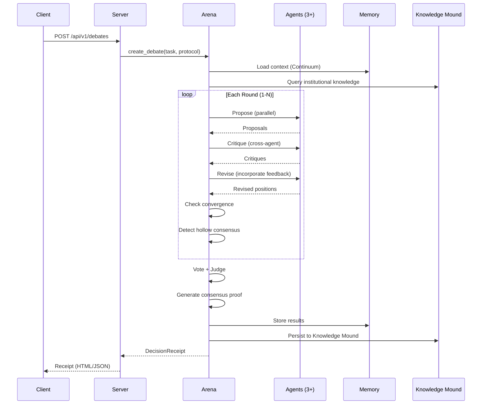
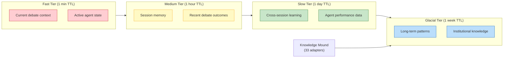

# Aragora System Architecture

Visual architecture diagram for the Decision Integrity Platform.

## High-Level System Overview

```mermaid
graph TB
    subgraph Clients["Client Layer"]
        CLI["CLI<br/>(aragora ask, gauntlet, review)"]
        SDK_PY["Python SDK<br/>(aragora-sdk)"]
        SDK_TS["TypeScript SDK<br/>(@aragora/sdk)"]
        WEB["Web Dashboard<br/>(Next.js)"]
        CHAT["Chat Connectors<br/>(Slack, Teams, Discord,<br/>Telegram, WhatsApp)"]
    end

    subgraph API["API Gateway"]
        SERVER["Unified Server<br/>(2,000+ operations)"]
        WS["WebSocket Stream<br/>(190+ event types)"]
        HANDLERS["580+ HTTP Handlers"]
        RBAC["RBAC Middleware<br/>(7 roles, 360+ perms)"]
    end

    subgraph Core["Debate Engine"]
        ARENA["Arena Orchestrator"]
        PHASES["Phases<br/>(Propose → Critique → Revise → Vote → Judge)"]
        CONSENSUS["Consensus Detection<br/>+ Proofs"]
        CONVERGENCE["Convergence<br/>(Semantic Similarity)"]
        TRICKSTER["Trickster<br/>(Hollow Consensus)"]
        ELO["ELO Rankings<br/>+ Calibration"]
    end

    subgraph Agents["Agent Pool (43 types)"]
        ANTHROPIC["Anthropic<br/>(Claude)"]
        OPENAI["OpenAI<br/>(GPT)"]
        GEMINI["Gemini"]
        GROK["Grok"]
        MISTRAL["Mistral"]
        OPENROUTER["OpenRouter<br/>(DeepSeek, Qwen, Kimi)"]
        LOCAL["Local Models"]
    end

    subgraph Memory["Memory & Knowledge"]
        CONTINUUM["Continuum Memory<br/>(fast / medium / slow / glacial)"]
        KM["Knowledge Mound<br/>(33 adapters)"]
        EVIDENCE["Evidence<br/>+ Provenance"]
        RLM["RLM<br/>(Context Structuring)"]
    end

    subgraph Infra["Infrastructure"]
        RESILIENCE["Resilience<br/>(Circuit Breaker, Retry)"]
        EVENTS["Event Dispatcher<br/>+ Dead Letter Queue"]
        OBSERVE["Observability<br/>(Metrics, Tracing, SLO)"]
        STORAGE["Storage<br/>(Postgres, Redis, SQLite)"]
    end

    subgraph Enterprise["Enterprise"]
        AUTH["Auth<br/>(OIDC, SAML, MFA)"]
        TENANT["Multi-Tenancy<br/>+ Isolation"]
        COMPLIANCE["Compliance<br/>(SOC 2, GDPR, HIPAA)"]
        BILLING["Billing<br/>+ Metering"]
        BACKUP["Backup<br/>+ DR"]
    end

    subgraph Self["Self-Improvement"]
        NOMIC["Nomic Loop<br/>(Debate → Design → Implement → Verify)"]
        GAUNTLET["Gauntlet<br/>(Adversarial Testing)"]
    end

    %% Client connections
    CLI --> SERVER
    SDK_PY --> SERVER
    SDK_TS --> SERVER
    WEB --> SERVER
    WEB --> WS
    CHAT --> SERVER

    %% API to Core
    SERVER --> RBAC
    RBAC --> HANDLERS
    HANDLERS --> ARENA
    WS --> ARENA

    %% Arena internals
    ARENA --> PHASES
    PHASES --> CONSENSUS
    PHASES --> CONVERGENCE
    CONSENSUS --> TRICKSTER
    ARENA --> ELO

    %% Arena to Agents
    ARENA --> ANTHROPIC
    ARENA --> OPENAI
    ARENA --> GEMINI
    ARENA --> GROK
    ARENA --> MISTRAL
    ARENA --> OPENROUTER
    ARENA --> LOCAL

    %% Memory connections
    ARENA --> CONTINUUM
    ARENA --> KM
    ARENA --> EVIDENCE
    ARENA --> RLM

    %% Infrastructure
    ARENA --> RESILIENCE
    ARENA --> EVENTS
    HANDLERS --> OBSERVE
    KM --> STORAGE

    %% Enterprise
    SERVER --> AUTH
    SERVER --> TENANT
    HANDLERS --> COMPLIANCE
    HANDLERS --> BILLING
    STORAGE --> BACKUP

    %% Self-improvement
    NOMIC --> ARENA
    NOMIC --> GAUNTLET

    %% Styling
    classDef client fill:#e1f5fe,stroke:#0288d1
    classDef api fill:#fff3e0,stroke:#f57c00
    classDef core fill:#fce4ec,stroke:#c62828
    classDef agent fill:#f3e5f5,stroke:#7b1fa2
    classDef memory fill:#e8f5e9,stroke:#2e7d32
    classDef infra fill:#eceff1,stroke:#546e7a
    classDef enterprise fill:#fff8e1,stroke:#f9a825
    classDef self fill:#ede7f6,stroke:#4527a0

    class CLI,SDK_PY,SDK_TS,WEB,CHAT client
    class SERVER,WS,HANDLERS,RBAC api
    class ARENA,PHASES,CONSENSUS,CONVERGENCE,TRICKSTER,ELO core
    class ANTHROPIC,OPENAI,GEMINI,GROK,MISTRAL,OPENROUTER,LOCAL agent
    class CONTINUUM,KM,EVIDENCE,RLM memory
    class RESILIENCE,EVENTS,OBSERVE,STORAGE infra
    class AUTH,TENANT,COMPLIANCE,BILLING,BACKUP enterprise
    class NOMIC,GAUNTLET self
```

## Debate Flow

```mermaid
sequenceDiagram
    participant C as Client
    participant S as Server
    participant A as Arena
    participant AG as Agents (3+)
    participant M as Memory
    participant K as Knowledge Mound

    C->>S: POST /api/v1/debates
    S->>A: create_debate(task, protocol)
    A->>M: Load context (Continuum)
    A->>K: Query institutional knowledge

    loop Each Round (1-N)
        A->>AG: Propose (parallel)
        AG-->>A: Proposals
        A->>AG: Critique (cross-agent)
        AG-->>A: Critiques
        A->>AG: Revise (incorporate feedback)
        AG-->>A: Revised positions
        A->>A: Check convergence
        A->>A: Detect hollow consensus
    end

    A->>A: Vote + Judge
    A->>A: Generate consensus proof
    A->>M: Store results
    A->>K: Persist to Knowledge Mound
    A-->>S: DecisionReceipt
    S-->>C: Receipt (HTML/JSON)
```

## Memory Tier Architecture

```mermaid
graph LR
    subgraph Fast["Fast Tier (1 min TTL)"]
        F1["Current debate context"]
        F2["Active agent state"]
    end

    subgraph Medium["Medium Tier (1 hour TTL)"]
        M1["Session memory"]
        M2["Recent debate outcomes"]
    end

    subgraph Slow["Slow Tier (1 day TTL)"]
        S1["Cross-session learning"]
        S2["Agent performance data"]
    end

    subgraph Glacial["Glacial Tier (1 week TTL)"]
        G1["Long-term patterns"]
        G2["Institutional knowledge"]
    end

    Fast --> Medium --> Slow --> Glacial

    KM["Knowledge Mound<br/>(33 adapters)"] --> Glacial

    classDef fast fill:#ffcdd2,stroke:#c62828
    classDef med fill:#fff9c4,stroke:#f9a825
    classDef slow fill:#c8e6c9,stroke:#2e7d32
    classDef glacial fill:#bbdefb,stroke:#1565c0

    class F1,F2 fast
    class M1,M2 med
    class S1,S2 slow
    class G1,G2 glacial
```
