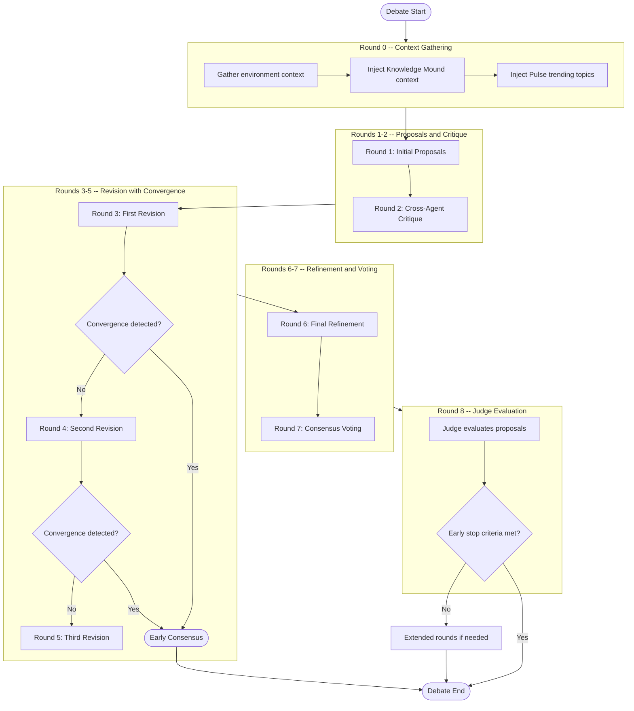
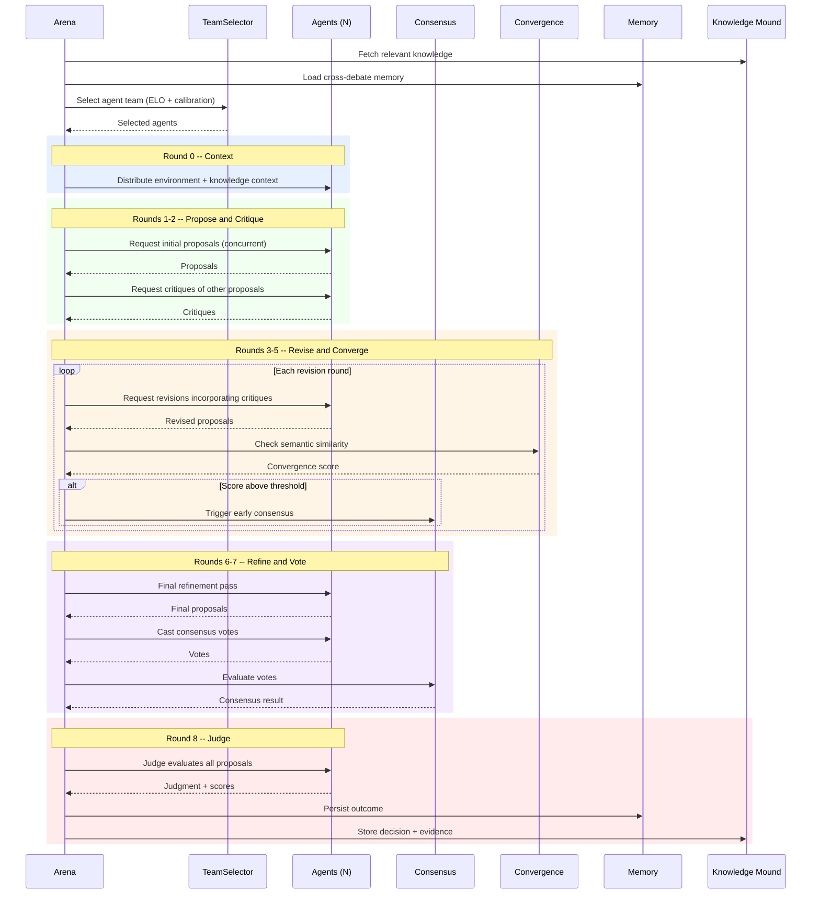

# Debate Flow

A structured 9-round debate orchestrated by the Arena class. Agents propose,
critique, revise, and converge toward consensus under judge evaluation.

## Round Structure

## Sequence Diagram

## Phase Details

| Round | Phase | Concurrency | Key Mechanism |
|-------|-------|-------------|---------------|
| 0 | Context | Sequential | Knowledge injection, Pulse topics |
| 1 | Proposals | `MAX_CONCURRENT_PROPOSALS` | Parallel agent generation |
| 2 | Critique | `MAX_CONCURRENT_CRITIQUES` | Cross-agent review |
| 3-5 | Revision | `MAX_CONCURRENT_REVISIONS` | Convergence detection per round |
| 6 | Refinement | Parallel | Incorporate all feedback |
| 7 | Voting | Parallel | Majority / supermajority consensus |
| 8 | Judgment | Single judge | ELO update, early stop check |

## Agent Roles

- **Proposers** -- Generate and revise solutions through rounds 1-6.
- **Critics** -- Evaluate proposals in round 2; all agents may critique.
- **Voters** -- All agents vote in round 7 on final proposals.
- **Judge** -- Single designated agent scores and ranks in round 8.
- **Trickster** (optional) -- Detects hollow consensus when enabled.
- **Rhetorical Observer** (optional) -- Monitors argument quality.

## Convergence Detection

Semantic similarity is measured between proposals at rounds 3, 4, and 5.
When the convergence score exceeds the configured threshold, the debate
short-circuits to consensus, saving compute and time. The threshold is
configurable via `DebateProtocol.convergence_threshold`.

## Post-Debate

After the debate concludes:

1. Results are routed to the originating channel (`debate_origin.py`).
2. ELO ratings are updated based on judge scores.
3. Memory coordinator atomically writes outcomes to all tiers.
4. Knowledge Mound stores the decision, evidence, and receipts.
5. Optional post-debate workflows trigger (e.g., notifications, exports).
