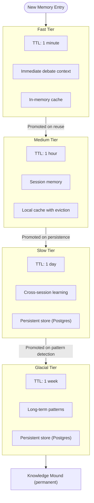
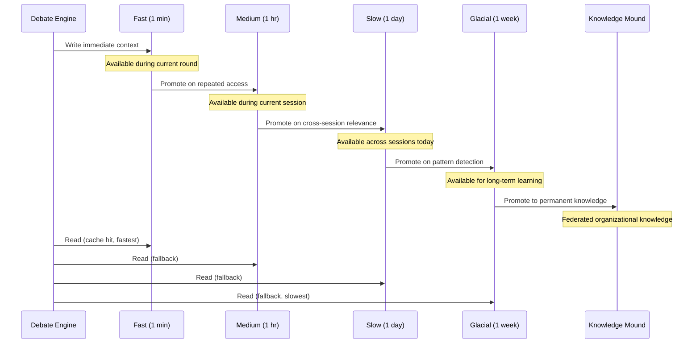
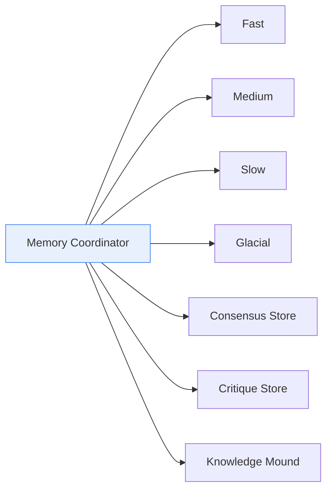

# Memory Tiers

Aragora uses a four-tier memory architecture (`ContinuumMemory`) to balance
speed, cost, and retention. Each tier serves a distinct temporal purpose, and
data flows from faster tiers to slower ones as it proves durably useful.

## Tier Architecture

## Data Flow Between Tiers

## Tier Summary

| Tier | TTL | Storage | Purpose | Access Pattern |
|------|-----|---------|---------|----------------|
| Fast | 1 min | In-memory | Current round context | Hot path, every read |
| Medium | 1 hr | Local cache | Session continuity | Within-session lookups |
| Slow | 1 day | Postgres | Cross-session learning | Start-of-session load |
| Glacial | 1 week | Postgres | Long-term patterns | Background analysis |

## Promotion Criteria

Entries move to a slower (longer-lived) tier when they demonstrate lasting value:

- **Fast to Medium** -- Entry is accessed more than once within its TTL.
- **Medium to Slow** -- Entry is referenced across multiple debate rounds or sessions.
- **Slow to Glacial** -- Pattern detection identifies the entry as part of a recurring theme.
- **Glacial to Knowledge Mound** -- Entry achieves sufficient confidence and is validated.

## Memory Coordinator

The `MemoryCoordinator` (`memory/coordinator.py`) provides atomic cross-system
writes when `enable_coordinated_writes` is active. This ensures that a debate
outcome is written to all relevant tiers and subsystems (memory, consensus store,
critique store, Knowledge Mound) as a single logical operation.

## Cross-Debate Memory

When `enable_cross_debate_memory` is set, the system injects institutional
knowledge from previous debates into new ones. This pulls from the Slow and
Glacial tiers to seed context, allowing agents to build on prior decisions
rather than starting from scratch.

## Related Modules

| Module | Path | Role |
|--------|------|------|
| ContinuumMemory | `aragora/memory/continuum.py` | Four-tier implementation |
| MemoryCoordinator | `aragora/memory/coordinator.py` | Atomic writes |
| ConsensusMemory | `aragora/memory/consensus.py` | Historical outcomes |
| MemoryManager | `aragora/debate/memory_manager.py` | Debate-level coordination |
