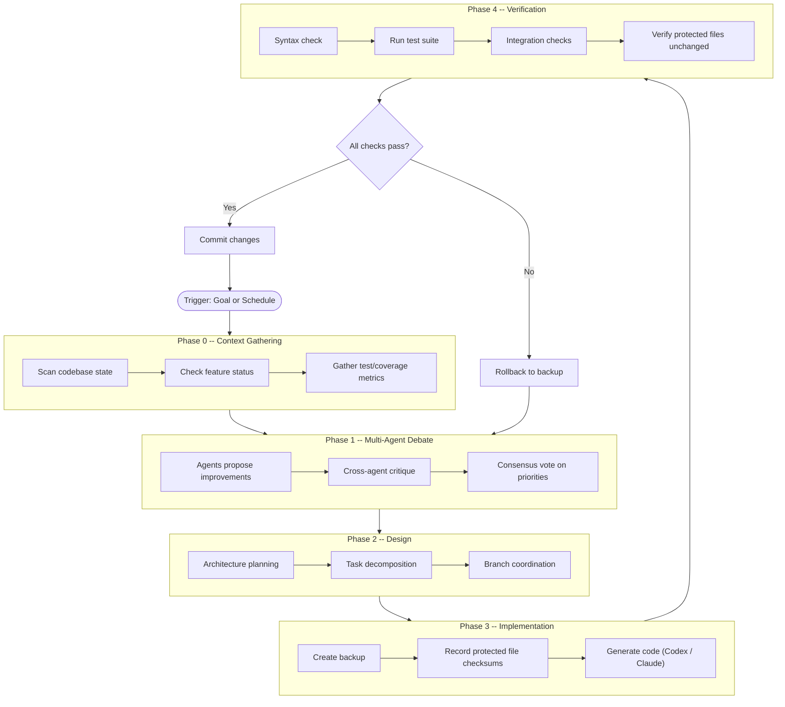
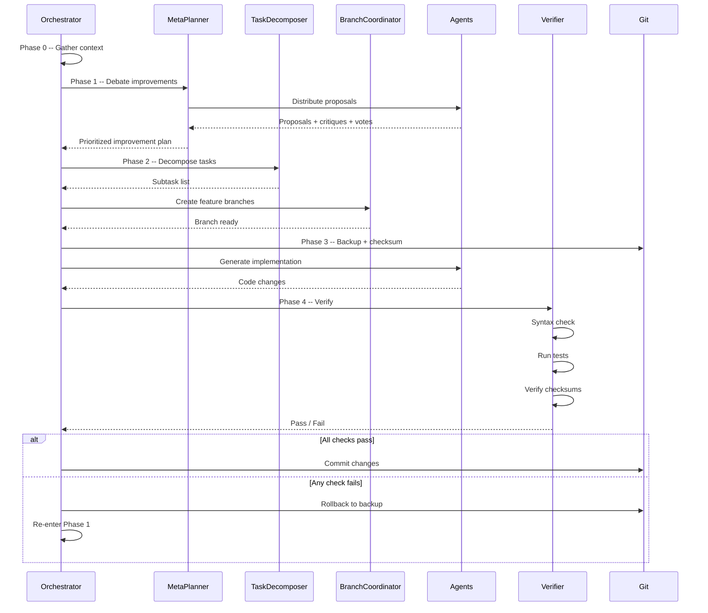

# Nomic Loop

The Nomic Loop is Aragora's autonomous self-improvement cycle. Agents debate
what to improve, design solutions, implement code, and verify changes -- all
with safety guardrails to prevent regressions.

## Loop Overview



## Sequence Diagram



## Safety Features

```mermaid
flowchart LR
    subgraph Before["Pre-Implementation"]
        Backup["Automatic backup"]
        Checksums["Protected file checksums"]
        Approval["Human approval gate (optional)"]
    end

    subgraph During["During Implementation"]
        Protected["Protected file guard"]
        BranchIsolation["Feature branch isolation"]
        Incremental["Incremental changes"]
    end

    subgraph After["Post-Implementation"]
        SyntaxCheck["Syntax validation"]
        TestSuite["Full test suite (45,100+ tests)"]
        ChecksumVerify["Checksum verification"]
        Rollback["Automatic rollback on failure"]
    end

    Before --> During --> After
```



| Safety Mechanism | When | What It Protects |
|------------------|------|------------------|
| Automatic backup | Before Phase 3 | Full codebase state |
| Protected file checksums | Before and after Phase 3 | `CLAUDE.md`, `core.py`, `__init__.py`, `nomic_loop.py` |
| Human approval gate | Between phases (optional) | High-risk changes |
| Feature branch isolation | Phase 3 | Main branch stability |
| Syntax validation | Phase 4 | Basic correctness |
| Test suite execution | Phase 4 | Functional correctness |
| Automatic rollback | On Phase 4 failure | Reverts all changes |

## CLI Entry Points

```bash
# Full autonomous run with approval gates
python scripts/self_develop.py --goal "Improve test coverage" --require-approval

# Dry run -- preview decomposition only
python scripts/self_develop.py --goal "Refactor dashboard" --dry-run

# Debate-based decomposition for abstract goals
python scripts/self_develop.py --goal "Maximize SME utility" --dry-run --debate

# Staged execution -- run individual phases
python scripts/nomic_staged.py debate
python scripts/nomic_staged.py design
python scripts/nomic_staged.py implement
python scripts/nomic_staged.py verify
python scripts/nomic_staged.py commit

# Streaming loop with multiple cycles
python scripts/run_nomic_with_stream.py run --cycles 3
```

## Key Components

| Component | Path | Role |
|-----------|------|------|
| Nomic Loop | `scripts/nomic_loop.py` | Core loop runner (protected) |
| MetaPlanner | `aragora/nomic/meta_planner.py` | Debate-driven goal prioritization |
| TaskDecomposer | `aragora/nomic/task_decomposer.py` | Break goals into subtasks |
| BranchCoordinator | `aragora/nomic/branch_coordinator.py` | Parallel branch management |
| AutonomousOrchestrator | `aragora/nomic/autonomous_orchestrator.py` | End-to-end orchestration |
| Staged Runner | `scripts/nomic_staged.py` | Phase-by-phase execution |
| Self-Develop CLI | `scripts/self_develop.py` | Goal-driven entry point |

## Track-Based Execution

The self-improvement system supports parallel execution across focus tracks:

```bash
python scripts/self_develop.py --goal "Improve platform" --tracks sme developer qa --max-parallel 2
```

Each track operates on its own feature branch, coordinated by `BranchCoordinator`,
and merged only after all verification checks pass.
