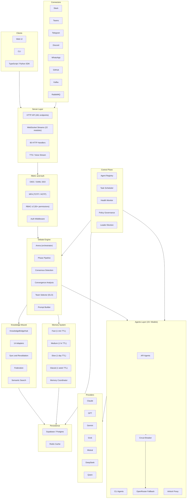

# System Overview

Top-level architecture of the Aragora platform -- a control plane for multi-agent
robust decision-making across organizational knowledge and channels.

## High-Level Architecture

## Component Responsibilities

| Layer | Key Modules | Purpose |
|-------|-------------|---------|
| Server | `unified_server.py`, `handlers/`, `stream/` | HTTP/WS API surface, TTS, voice |
| Auth | `rbac/`, `auth/` | OIDC/SAML SSO, MFA, fine-grained RBAC |
| Debate Engine | `debate/orchestrator.py`, `consensus.py` | Multi-round structured debates |
| Agents | `agents/api_agents/`, `cli_agents.py` | 15+ model integrations with fallback |
| Memory | `memory/continuum.py`, `coordinator.py` | Four-tier memory with atomic writes |
| Knowledge | `knowledge/mound/`, `bridges.py` | 14 adapters, semantic search, federation |
| Control Plane | `control_plane/` | Registry, scheduling, health, policy |
| Connectors | `connectors/` | Chat platforms, enterprise event streams |
| Persistence | External | Supabase/Postgres, Redis |

## Data Flow Summary

1. Requests enter via HTTP/WebSocket or connector webhooks.
2. Auth middleware validates identity and RBAC permissions.
3. The Debate Engine orchestrates agents through structured rounds.
4. Agents call external LLM providers; failures trigger circuit breaker and fallback.
5. Memory tiers cache context at varying lifetimes.
6. Knowledge Mound persists and federates organizational knowledge.
7. Control Plane governs scheduling, health, and policy across the system.
8. Results route back to the originating channel (web, Slack, Telegram, etc.).
