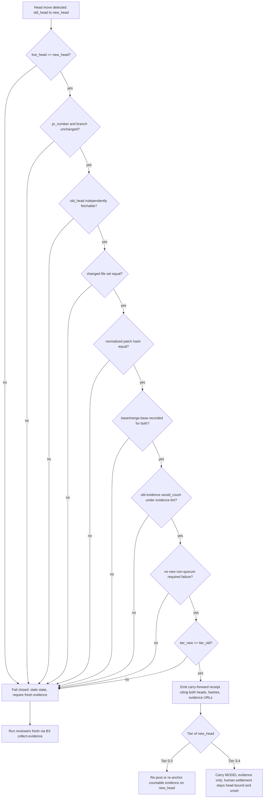
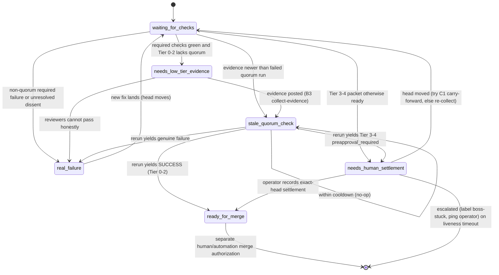

# Boss-Loop & Merge-Gate Resilience — Phase 3 Design (C1/C2)

**Status:** draft / design-only (no implementation authorization)
**Author:** Droid (continuation of the live settlement-resilience work, 2026-06-04)
**Scope:** Operational design for the two Phase-3 resilience features — C1
(equivalent-evidence carry-forward) and C2 (active settlement controller).

> **Read this with the threat model.** The authoritative security boundary for
> both features is
> [`MERGE_GATE_CARRY_FORWARD_THREAT_MODEL.md`](MERGE_GATE_CARRY_FORWARD_THREAT_MODEL.md)
> (landed in #7751). That document defines the assets, trust boundaries,
> required proofs, forbidden actions, and acceptance criteria. **This document
> does not restate or relax any of them.** It adds the *operational* layer the
> threat model intentionally omits: concrete decision/state diagrams, a receipt
> schema, a module layout, and an integration + sequencing plan. Where the two
> ever appear to disagree, the threat model wins.

> **No-code deliverable.** This is design only. C1 and C2 are adjacent to the
> merge-authority surface; any code that carries evidence, reruns gates, posts
> quorum evidence, sets settlement state, or merges PRs is a Tier-4
> self-modification and must be classified against
> `docs/REVIEW_AUTHORITY_PRINCIPLES.md` and human-preapproved before
> implementation and before merge.

---

## 1. Where Phase 3 sits

The merge-gate resilience effort is sequenced as:

| Phase | Theme | Status |
| --- | --- | --- |
| 1 | Safe/additive self-heal: quorum-rerun reconciler (A1), settlement-state visibility (A2) | landed (`scripts/reconcile_merge_quorum.py`, `scripts/settle_status.py`) |
| 2 | Governance-touching at source: evidence-triggered re-eval (B1), break the circular short-circuit (B2), deterministic low-tier evidence collection (B3) | B2 merged (#7740); B1 (#7742) and B3 (#7750) prepared at the Tier-4 settlement gate |
| 3 | **Churn + liveness: carry-forward (C1), active controller (C2)** | **this doc — design only** |

Phase 3 exists because Phases 1-2 make the gate *recover* but do not yet stop the
two structural drains observed live:

- **Churn (C1):** a no-semantic-change head move (merge-from-main to pick up a
  fix) wipes a complete head-bound quorum and forces full re-assembly.
- **Liveness (C2):** every safe recovery action exists, but as advisory
  suggestions; nothing executes them deterministically or escalates on a
  timeout.

Phase 2's B3 (`review-queue collect-evidence`, #7750) is the bounded, tier-gated,
never-fabricate evidence collector. **C2 reuses B3 as its evidence-collection
action**, so the controller never needs its own posting logic — it orchestrates
already-reviewed, already-linted, tier-gated building blocks.

---

## 2. C1 — Equivalent-Evidence Carry-Forward (design)

### 2.1 Goal

After a head move whose **reviewable diff is provably unchanged**, reuse the
prior head-bound model-review evidence by emitting a carry-forward receipt,
instead of re-running every reviewer. Human settlement is never carried.

### 2.2 Eligibility predicate (concrete)

Carry-forward is permitted **only if every clause is true**; otherwise it fails
closed to fresh evidence. Each clause maps to a required proof / attack path in
the threat model.

```
eligible(old_head, new_head, pr) :=
    live_head(pr) == new_head                      # not a stale cache (TB: PR head truth)
  ∧ pr_number unchanged ∧ head_branch unchanged    # (Proof 2)
  ∧ old_head independently fetchable               # (Forbidden: lost-old-head force-push)
  ∧ changed_file_set(old_head) == changed_file_set(new_head)   # (Attack: file-set drift)
  ∧ norm_patch_hash(old_head) == norm_patch_hash(new_head)     # (Attack: patch smuggling)
  ∧ merge_base/base_sha recorded for both          # (Attack: base confusion)
  ∧ old_evidence.would_count under evidence-lint   # (Proof 4)
  ∧ no NEW non-quorum required-check failure at new_head        # (Proof 6)
  ∧ tier(new_head) ≤ tier(old_head)                # tier never silently drops
```

`norm_patch_hash` = SHA-256 over the normalized `gh pr diff` (stable file
ordering, hunk headers stripped of line-number offsets, trailing whitespace
collapsed) so that an ancestry-only move hashes identically while any semantic
edit diverges. The normalization function is itself security-sensitive and must
be unit-tested against the attack corpus in §2.5.

### 2.3 Decision flow



The two terminal branches encode the central invariant: **model evidence may
carry; human settlement may not.** A Tier 3-4 carry-forward still leaves
`aragora/human-settlement` unset on `new_head`, so the operator re-accepts the
exact new state (threat model: "Settlement replay" defense).

### 2.4 Carry-forward receipt schema

Append-only, one per carry-forward decision (including refusals, for audit):

```json
{
  "kind": "merge_gate_carry_forward_receipt",
  "pr_number": 7720,
  "old_head": "<40-hex>",
  "new_head": "<40-hex>",
  "decision": "carried | refused",
  "refusal_reason": "file_set_drift | patch_mismatch | ...",
  "comparison_method": "normalized_gh_pr_diff_sha256",
  "old_norm_patch_sha256": "<hex>",
  "new_norm_patch_sha256": "<hex>",
  "old_base_sha": "<40-hex>",
  "new_base_sha": "<40-hex>",
  "changed_files": ["..."],
  "old_evidence_urls": ["https://github.com/.../pull/7720#issuecomment-..."],
  "tier_old": 4,
  "tier_new": 4,
  "human_settlement_carried": false,
  "generated_at": "2026-06-04T00:00:00Z",
  "actor": "settlement_controller@<host>"
}
```

`human_settlement_carried` is structurally pinned to `false` — the writer must
refuse to serialize a receipt where it is true.

### 2.5 Required tests before any implementation

Mirror the threat model's acceptance criteria as executable tests:

- ancestry-only merge-from-main → `decision == carried`, identical hashes;
- one-line semantic edit hidden in a merge → `decision == refused` (patch hash);
- a new file added → `refused` (file-set drift);
- same patch text re-based onto a different base → `refused` (base confusion);
- force-push that orphans `old_head` → `refused` (unfetchable old head);
- any PR touching workflow / quorum code → treated Tier 4, settlement never
  carried;
- a serializer attempt with `human_settlement_carried=true` raises.

### 2.6 Where it lives

`aragora/swarm/carry_forward.py` (pure predicate + normalizer + receipt writer,
fully unit-testable offline) and a thin `scripts/carry_forward_evidence.py`
(default `--dry-run`, prints the receipt + decision; `--apply` re-anchors Tier
0-2 evidence only). Reuses `merge_quorum_io` for `gh` I/O and the
`review-queue evidence-lint` parser so detection equals counting.

---

## 3. C2 — Active Settlement Controller (design)

### 3.1 Goal

Promote the advisory unstick plan (`aragora/swarm/unstick.py`,
`scripts/boss_loop_unstick_plan.py`) into a controller that **executes only
allowlisted safe actions** and **escalates everything else**, with per-PR
liveness tracking and append-only receipts. It automates *liveness recovery,
never risk acceptance.*

### 3.2 State machine



Mapping to the threat model's allowed/forbidden action lists:

| State | Controller action | Authority |
| --- | --- | --- |
| `waiting_for_checks` | observe/report | safe |
| `needs_low_tier_evidence` | **B3 `collect-evidence --apply`** (Tier 0-2 only) | safe (bounded, lint-gated) |
| `stale_quorum_check` | `gh run rerun` once per cooldown (A1 reconciler) | safe (read-only re-eval) |
| `needs_human_settlement` | **stop**; prepare packet; emit prompt | human-only stop |
| `real_failure` | **stop**; report defect | human-only stop |
| `ready_for_merge` | report ready; **do not merge by default** | separate authorization |

The only mutating autonomous transitions are `needs_low_tier_evidence` (post
Tier 0-2 evidence via B3) and `stale_quorum_check` (rerun via A1). Every Tier 3-4
path is a **stop**.

### 3.3 Liveness, cooldown, escalation

- **`last_progress_at` per PR.** A transition that changes observable gate state
  (new countable evidence, new quorum conclusion, settlement recorded) refreshes
  it; a no-op (within cooldown) does not.
- **Cooldown + max-reruns per head** (e.g. ≥10 min between reruns, ≤N reruns per
  head) prevent retry storms — reuse A1's existing guards.
- **Escalation:** if a PR sits in `needs_human_settlement` or `real_failure`
  beyond a threshold, label `boss-stuck` and ping the operator (existing
  notification + `agent_heartbeat.py` surfaces) rather than acting.

### 3.4 Controller receipts

Every action (taken **or refused**) writes the append-only receipt the threat
model requires: PR number, exact head, tier + reason, action taken/refused,
command executed, evidence URLs / run IDs, cooldown key + attempt count, next
safe action. Receipts are the retry-storm guard and the audit trail.

### 3.5 Where it lives

`aragora/swarm/settlement_controller.py` (state machine + action dispatch over
injectable I/O, offline-testable) layered on `unstick.py`. A thin
`scripts/run_settlement_controller.py` (default `--dry-run` prints the
state+plan; `--apply` enables **one action class at a time** behind explicit
flags, e.g. `--enable-rerun`, `--enable-low-tier-collect`). It composes the
already-shipped pieces:

- A1 `reconcile_merge_quorum.py` → the `stale_quorum_check` action;
- A2 `settle_status.py` → the read model for state classification;
- B3 `review-queue collect-evidence` → the `needs_low_tier_evidence` action;
- C1 `carry_forward.py` → the `head moved` edge out of `needs_human_settlement`.

### 3.6 Required tests before any implementation

- stale cache/transcript cannot trigger action when live PR state differs;
- Tier 3-4 paths stop before any settlement mutation (no `aragora/human-settlement`
  write, no authorization comment, no merge);
- cooldown + max-rerun bounds hold under repeated invocation;
- every mutating action emits a receipt; refusals emit a receipt too;
- branch-protection / `enforce_admins` / merge commands are absent from the
  autonomous action allowlist (assert by construction).

---

## 4. Sequencing & validation

1. **C1 predicate + normalizer, dry-run only** — pure functions + the attack
   corpus (§2.5). No posting, no rerun. Validate hashes against real
   merge-from-main vs semantic-edit fixtures.
2. **C1 apply (Tier 0-2 re-anchor only)** — behind a flag, with receipts.
3. **C2 controller, dry-run only** — classify live open PRs into states; emit
   plans + receipts; compare against `settle_status` ground truth.
4. **C2 apply, one action class at a time** — enable `--enable-rerun` first
   (lowest risk, read-only re-eval), then `--enable-low-tier-collect` (B3).
   Tier 3-4 remains stop-only permanently.

Each step is independently reversible (dry-run default, additive modules,
branch-scoped) and gated on the threat model's acceptance criteria.

## 5. Non-goals / invariants (unchanged from the threat model)

- Never auto-settle Tier 3/4 — human risk settlement is non-delegable.
- Never carry `aragora/human-settlement` across a head move.
- Never fabricate evidence — only genuine, head-grounded, `evidence-lint`-clean
  model reviews (enforced by B3).
- Never weaken the gate or disable `enforce_admins`; re-running a read-only
  evaluation can never pass a genuinely failing PR.
- Live `gh pr view` + required checks always outrank any cached queue/transcript
  state.

## 6. Open questions for review

- **Normalization fidelity:** is normalized-`gh pr diff` SHA-256 sufficient, or
  should C1 compare tree hashes of the reviewable paths to defend against
  whitespace/rename edge cases? (Leaning: include rename detection in the
  changed-file-set clause.)
- **Carry-forward re-anchoring shape:** for Tier 0-2, re-post fresh comments on
  `new_head` vs. post a single citation-receipt comment that `evidence-lint`
  recognizes? The latter needs a parser change (Tier-4) — defer unless churn
  data justifies it.
- **Controller cadence:** reuse the 5-min worktree-maintainer LaunchAgent vs. a
  dedicated timer, and what `boss-stuck` escalation threshold matches operator
  response latency.
